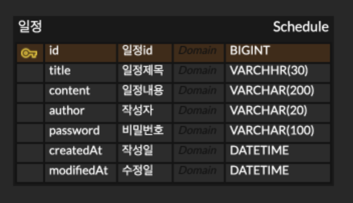

# 일정 관리 앱

Spring Boot와 JPA를 활용한 일정 관리 REST API 서버입니다.

## 실행 방법

1. `application.properties.example`을 복사해 `application.properties`로 이름 변경
2. DB 연결 정보 입력
3. MySQL에서 데이터베이스 생성
```sql
   CREATE DATABASE schedule_db;
```
4. 애플리케이션 실행
```bash
   ./gradlew bootRun
```
5. `http://localhost:8080` 접속 확인


## 📋 API 명세

# 일정 API 
<details>
  <summary>일정 생성 API 명세</summary>

**URL :** /schedules

**Method : POST**

**01 : 설명**

새로운 일정을 생성하는 api입니다

**02 : 요청 (Request)**

**a. Parameter & Querystring**

-

**b. Request Headers**

| **이름** | **데이터타입** | **설명** |
| --- | --- | --- |
| `Content-Type` | `String` | application/json 고정 |

**c. Request Body**

{

    "title":    "일정 제목",
    "content":  "일정 과제 하기",
    "author":   "홍길동",
    "password": "1234123"
}

| **이름** | **데이터타입** | **필수여부** | **설명** |
| --- | --- | --- |--------|
| `title` | `String` | **필수** | 일정 제목  |
| `content` | `String` | **필수** | 일정 내용  |
| `author` | `String` | **필수** | 작성자명   |
| `password` | `String` | **필수** | 비밀번호   |

**03 : 응답 (Response)**

**a. Response Headers**

| **이름** | **데이터타입** | **설명** |
| --- | --- | --- |
| `Content-Type` | `String` | application/json |

**b. Response Body**

**201 Created :** 일정 생성 성공

**성공 응답**

{

    "id":         1,
    "title":     "일정 제목",
    "content":   "일정 과제 하기",
    "author":    "홍길동",
    "createdAt":  "2026-04-13T11:00:00",
    "modifiedAt": "2026-04-13T11:00:00"
}

| **이름** | **데이터타입** | **설명** |
| --- | --- | --- |
| `id` | `Long` | 자동 생성된 일정 고유 ID |
| `title` | `String` | 일정 제목 |
| `content` | `String` | 일정 내용 |
| `author` | `String` | 작성자명 |
| `createdAt` | `LocalDateTime` | 작성일 |
| `modifiedAt` | `LocalDateTime` | 수정일 |

**실패 응답 예시**

{

    "error": "제목은 필수 값 입니다."
}
</details>

# 전체 조회 API
<details>

  <summary>전체 조회 API 명세</summary>

**URL :** /schedules

**Method : GET**

**01 : 설명**

등록된 전체 일정 목록을 조회하는 api입니다

**02 : 요청 (Request)**

**a. Parameter & Querystring**

| **이름**   | **데이터타입** | **설명** |
|----------| --- | --- |
| `author` | `String` | 작성자명 필터 |

**b. Request Headers**

| **이름** | **데이터타입** | **설명** |
| --- | --- | --- |
| `Content-Type` | `String` | application/json 고정 |

**c. Request Body**


**03 : 응답 (Response)**

**a. Response Headers**

| **이름** | **데이터타입** | **설명** |
| --- | --- | --- |
| `Content-Type` | `String` | application/json |

**b. Response Body**

**200 OK :** 조회 성공

**성공 응답**
```
[ 
    {
        "id":       1,
        "title":    "일정 제목",
        "content":  "일정 과제 하기",
        "author":   "홍길동",
        "createdAt":  "2026-04-13T11:00:00",
        "modifiedAt": "2026-04-13T11:00:00"
    },
    {
        "id":       2,
        "title":    "일정 제목2",
        "content":  "일정 과제 하기2",
        "author":   "홍길동2",
        "createdAt":  "2026-04-13T11:01:00",
        "modifiedAt": "2026-04-13T11:01:00"
    },
]
```

| **이름**     | **데이터타입** | **필수여부** | **설명**   |
|------------|-----------| --- |----------|
| `id`       | `Long`    | **필수** | 일정 고유 id |
| `title`    | `String`  | **필수** | 일정 제목    |
| `content`  | `String`  | **필수** | 일정 내용    |
| `author`   | `String`  | **필수** | 작성자명     |
| `createdAt` | `LocalDateTime` | **필수** | 작성일 |
| `modifiedAt` | `LocalDateTime` | **필수** | 수정일 |


**실패 응답 예시**

**400 Bad Request :** 조회 실패

{

    "error": "조회를 실패 하였습니다."
}
</details>

# 단건 조회 API
<details>

  <summary>단건 조회 API 명세</summary>

**URL :** /schedules/{scheduleId}

**Method : GET**

**01 : 설명**

특정 일정 하나를 ID로 조회하는 api입니다

**02 : 요청 (Request)**

**a. Parameter & Querystring**

| **이름** | **데이터타입** | **설명** |
|--------|-----------| --- |
| `id`   | `Long`    | 조회할 일정의 고유 ID |


**03 : 응답 (Response)**

**a. Response Headers**

| **이름** | **데이터타입** | **설명** |
| --- | --- | --- |
| `Content-Type` | `String` | application/json |

**b. Response Body**

**200 OK :** 조회 성공

**성공 응답**
```

{
    "id":       1,
    "title":    "일정 제목",
    "content":  "일정 과제 하기",
    "author":   "홍길동",
    "createdAt":  "2026-04-13T11:00:00",
    "modifiedAt": "2026-04-13T11:00:00"
}

```

| **이름**     | **데이터타입** | **필수여부** | **설명**   |
|------------|-----------| --- |----------|
| `id`       | `Long`    | **필수** | 일정 고유 id |
| `title`    | `String`  | **필수** | 일정 제목    |
| `content`  | `String`  | **필수** | 일정 내용    |
| `author`   | `String`  | **필수** | 작성자명     |
| `createdAt` | `LocalDateTime` | **필수** | 작성일 |
| `modifiedAt` | `LocalDateTime` | **필수** | 수정일 |


**실패 응답 예시**

**400 Bad Request :** 조회 실패

{

    "error": "해당 id에 대한 일정이 없습니다."
}
</details>

# 수정 API
<details>
  <summary>일정 수정 API 명세</summary>

**URL :** /schedules/{scheduleId}

**Method : PATCH**

**01 : 설명**

특정 일정의 제목(title)과 작성자명(author)을 수정합니다.<br>
내용(content)과 비밀번호(password)는 수정할 수 없습니다. <br>
요청 시 비밀번호를 함께 전달해야 하며, 저장된 비밀번호와 일치할 때만 수정됩니다.

**02 : 요청 (Request)**

**a. Parameter & Querystring**

| **이름** | **데이터타입** | **설명** |
|--------|-----------| --- |
| `id`   | `Long`    | 수정할 일정의 고유 ID  |

**b. Request Headers**

| **이름** | **데이터타입** | **설명** |
| --- | --- | --- |
| `Content-Type` | `String` | application/json 고정 |

**c. Request Body**

{

    "title":    "일정 제목1",
    "author":   "성춘향",
    "password": "1234123"
}


| **이름** | **데이터타입** | **필수여부** | **설명**    |
| --- | --- | --- |-----------|
| `title` | `String` | **필수** | 변경할 일정 제목 |
| `author` | `String` | **필수** | 변경할 작성자명  |
| `password` | `String` | **필수** | 기존 비밀번호   |

**03 : 응답 (Response)**

**a. Response Headers**

| **이름** | **데이터타입** | **설명** |
| --- | --- | --- |
| `Content-Type` | `String` | application/json |

**b. Response Body**

**200 OK :** 일정 수정 성공

**성공 응답**

{

    "id":         1,
    "title":     "일정 제목1",
    "content":   "일정 과제 하기",
    "author":    "성춘향",
    "createdAt":  "2026-04-13T11:00:00",
    "modifiedAt": "2026-04-13T12:00:00"
}

| **이름** | **데이터타입** | **설명**          |
| --- | --- |-----------------|
| `id` | `Long` | 자동 생성된 일정 고유 ID |
| `title` | `String` | 수정된 제목          |
| `content` | `String` | 일정 내용           |
| `author` | `String` | 수정된 작성자명        |
| `createdAt` | `LocalDateTime` | 작성일             |
| `modifiedAt` | `LocalDateTime` | 수정 완료된 날짜       |

**실패 응답 예시**

**400 Bad Request :** 비밀번호 불일치 또는 해당 id 없음 또는 입력값 오류

{

    "error": "비밀번호가 일치하지 않습니다."
}
</details>

# 삭제 API
<details>

  <summary>일정 삭제 API 명세</summary>

**URL :** /schedules/{scheduleId}

**Method : DELETE**

**01 : 설명**

특정 일정 하나를 삭제하는 api입니다

**02 : 요청 (Request)**

**a. Parameter & Querystring**

| **이름** | **데이터타입** | **설명**        |
|--------|-----------|---------------|
| `id`   | `Long`    | 삭제할 일정의 고유 ID |

**b. Request Body**

{

    "password": "1234123"
}

| 이름 | 데이터타입 | 필수여부 | 설명 |
|------|-----------|---------|------|
| `password` | `String` | 필수 | 기존 비밀번호 |


**03 : 응답 (Response)**

**a. Response Headers**

| **이름** | **데이터타입** | **설명** |
| --- | --- | --- |
| `Content-Type` | `String` | application/json |

**b. Response Body**

| **이름**     | **데이터타입** | **설명**  |
|------------| --- |---------|
| `password` | `String` | 기존 비밀번호 |

**204 NO CONTENT :** 삭제 성공

**성공 응답**
없음

**실패 응답 예시**

**400 Bad Request :** 삭제 실패

{

    "error": "비밀번호가 일치하지 않습니다."
}
</details>


## ERD


## 프로젝트 구조

```
src/main/java/com/schedule/
                    ├── ScheduleApplication.java
                    ├── controller/   ScheduleController.java
                    ├── dto/          CreateScheduleRequestDto.java
                    │    ├──          CreateScheduleResponseDto.java
                    │    ├──          GetScheduleResponseDto.java
                    │    ├──          UpdateScheduleRequestDto.java
                    │    └──          UpdateScheduleResponseDto.java
                    │                        
                    ├── entity/       Schedule.java
                    │                 BaseEntity.java
                    ├── repository/   ScheduleRepository.java
                    └── service/      ScheduleService.java
